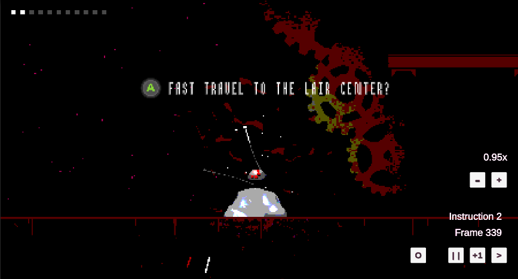

# UnityTAS 🏃🏽‍♀️🎮🔧

**Description**:  UnityTAS is a plug-n-play Tool Assisted Speedrun editor made for game devs who want to add a TAS capability to their games. It is the first and only TAS editor made for Unity. It greatly simplifies the integration of a TAS system to a game.

- **Limitations** : It only works for games that have gamepad support. Make sure to disconnect all your gamepads before using.
- **Technology stack**: Unity C# module
- **Status**: Beta



## Dependencies
- Unity 2021.3 and above
- Your game must use have gamepad support and use the new Input System
- Unity's Input System 1.3.0 and above
- Unity's TextMeshPro 3.0.6 and above

## Installation

Add the following line to your manifest.json in your Unity project root

```
"com.petitlegume.unitytas": "https://github.com/petitlegume/UnityTAS.git"
```

## Configuration

**With UI**
In Unity, go to `Packages/Unity TAS/Prefabs` and drag the **TAS** prefab into your game scene.

**Without UI** 
In Unity, go to `Packages/Unity TAS/Prefabs/Components` and drag the **TAS Manager** prefab into your game scene.

## Usage

UnityTAS reads frame intructions from a tasconfig.json file in the persistent data folder of your project. 

On windows, your persistent data folder should be similar to `C:/users/<USER>/AppData/LocalLow/<CompanyName>/<ProjectName>/`

On Linux, your persistent data folder should be similar to 
`/home/.config/unity3d/<CompanyName>/<ProjectName>/`

1. Create a tasconfig.json in your persistent data folder
2. Enter your configuration and intructions
3. Make sure your gamepads are disconnected before launching the scene with the TAS editor
4. Use the on-screen UI for the hotkeys

**Hotkeys**

| Key | Description |
| --- | --- |
| space | Play/Pause |
| enter | Go to next frame. Only available when paused. |
| backspace | Restart |
| - | Reduce speed |
| = | Increase speed |

## Properties for tasconfig.json

The tasconfig.json have the following properties:

| Property | Required | Type | Description |
| --- | --- | --- | --- |
| speed | No | float | Desired initial timescale |
| instructions | yes | Instruction[ ] | List of the instructions |

**Instruction properties**

| Property | Required | Type | Description |
| --- | --- | --- | --- |
| break | No | boolean | Instruct UnityTAS to break at this instruction |
| frames | No | int | Number of frames to execute this instruction |
| ls | No | int [ ] | Left Stick values Eg. ( [ 0.44, -0.2 ] ) |
| rs | No | int [ ] | Right Stick values Eg. ( [ 0.44, -0.2 ] ) |
| lsb | No | boolean | Left Stick button |
| rsb | No | boolean | Right Stick button |
| a | No | boolean | A button |
| b | No | boolean | B button |
| x | No | boolean | X button |
| y | No | boolean | Y button |
| lb | No | boolean | Right Button button |
| rb | No | boolean | Left Button button |
| lt | No | float | Left Trigger button. Accepts a value from 0 to 1 |
| rt | No | float | Right Trigger button. Accepts a value from 0 to 1 |
| start | No | boolean | Start button |
| select | No | boolean | Select button |

Example:

```
{ 
 "speed": 0.25,
 "instructions": [
  { "ls": [0.6, 0.934], "a": true },
  { "b": true, frames: 67 },
  { "rt" : 0.67, frames: 5, break: true }
 ]
}
```

## Known issues

UnityTAS does not work with a gamepad plugged in. Make sure to disconnect all your gamepads before using.

## Getting help

If you have questions, concerns, bug reports, etc, please file an issue in this repository's Issue Tracker.

To get in touch with me directly you can PM me on twitter at [@trespetitlegume](https://twitter.com/trespetitlegume)

## Getting involved

Contributions to UnityTAS are welcome! There are no guideline at the moment on the procedures for contributing.

## Credits

This project was initiated to introduce a TAS editor in the game [Joshua's Legs](https://store.steampowered.com/app/1934330/Joshuas_Legs/)
